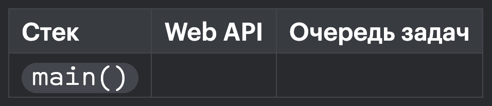
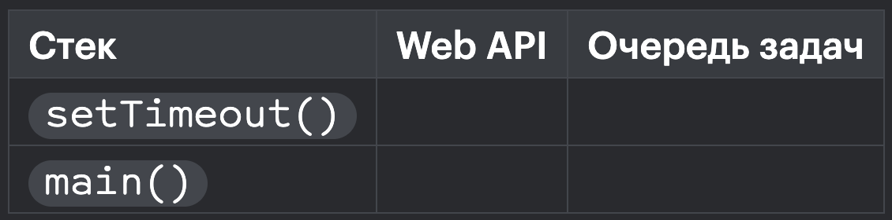
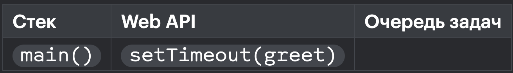
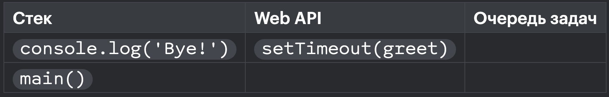
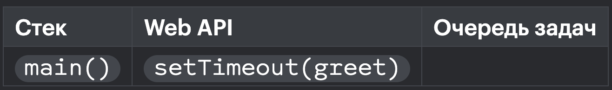
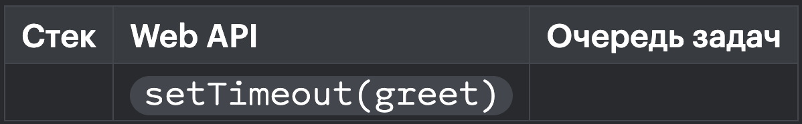
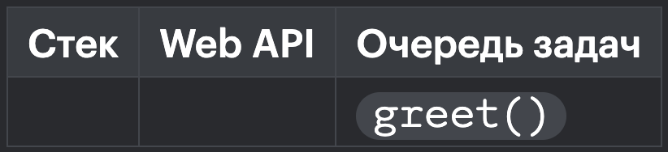
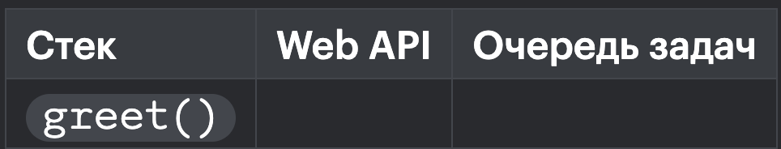
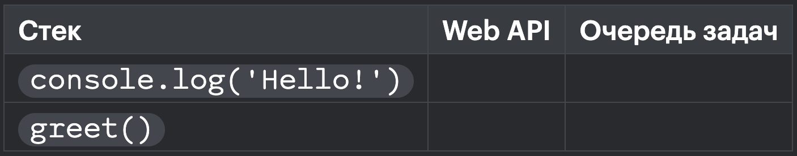

```js
function main() {
  setTimeout(function greet() {
    console.log('Hello!')
  }, 2000)

  console.log('Bye!')
}

main()
```

теперь у нас будет не только стек вызовов — также мы включим Web API и очередь задач, которую Web API использует для хранения того, что нужно выполнить.

Вызов main():



В Web API и очереди задач пока пусто.

Вызов setTimeout():



Когда setTimeout() исчезает из стека, он попадает в видимость Web API, где интерпретатор понимает, что внутри него есть функция greet(), которую надо выполнить через 2 секунды:



После этого выполняется вызов консоли console.log('Bye!'). В Web API находится функция setTimeout(greet). Она будет там до тех пор, пока не пройдёт 2 секунды:



Отработал console.log(), заканчивается работа main():



main() отработал, стек пуст. 2 секунды ещё не прошло, поэтому setTimeout(greet) все ещё в Web API:



Наконец, 2 секунды прошли - функция greet() перемещается в очередь задач:



Теперь цикл событий перемещает функцию greet() из списка задач в вызов:



Затем вызов console.log('Hello!'):



И наконец стек пуст.
Заметьте, что стек вызовов и очередь задач называются именно стеком и очередью. Потому что вызовы из стека работают по принципу «последний зашёл, первый вышел» (LIFO: last in, first out), а в очереди — по принципу «первый зашёл, первый вышел» (FIFO: first in, first out).

Очередь — структура данных, в которой элементы упорядочены так, что первый попавший в очередь элемент покидает её первым.
